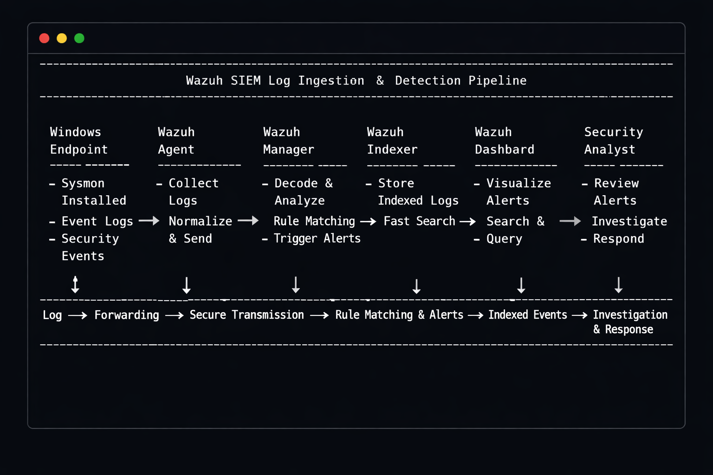

# Wazuh-SIEM-Log-Ingestion-Detection-Pipeline
A visual walkthrough of how Sysmon logs flow through the Wazuh SIEM pipeline—from endpoint collection to rule matching, indexing, alerting, and investigation. Demonstrates my ability as a Security Analyst to understand log ingestion, detection logic, and alert workflows.

